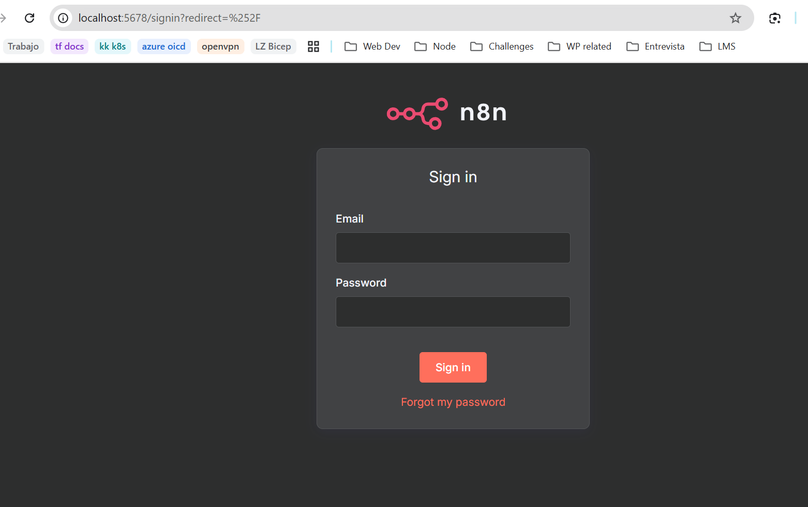

# n8n Docker Setup - Production Ready


*n8n running locally on port 5678 with secure login interface*

This setup runs n8n with Traefik as a reverse proxy, PostgreSQL database, SSL certificates, and automatic updates via Watchtower.

## Features

- **n8n Workflow Automation** - Latest version with auto-updates
- **PostgreSQL Database** - Production-ready data storage
- **SSL Certificates** - Secure HTTPS access via mkcert
- **Traefik Reverse Proxy** - Professional routing and load balancing
- **Selective Auto-Updates** - Keep n8n current while maintaining infrastructure stability
- **Email Notifications** - Optional update notifications

## Prerequisites

1. **Docker and Docker Compose** installed on your system
2. **Administrative access** to modify your hosts file
3. **mkcert** installed for SSL certificates (optional but recommended)

## Quick Start

### 1. Environment Setup

Copy the template environment file and customize it:
```bash
cp .env.template .env
```

Edit `.env` with your settings:
- `DOMAIN_NAME`: Your domain name
- `SUBDOMAIN`: Subdomain for n8n (default: n8n)
- `POSTGRES_PASSWORD`: Secure database password
- Email settings for Watchtower notifications (optional)

### 2. Configure your hosts file (REQUIRED)

You need to add your domain to your hosts file so it points to localhost:

**Windows:**
1. Open Notepad as Administrator
2. Open the file: `C:\Windows\System32\drivers\etc\hosts`
3. Add this line at the end:
   ```
   127.0.0.1 n8n.demo.test
   ```
4. Save the file

**Mac/Linux:**
1. Open terminal
2. Run: `sudo nano /etc/hosts`
3. Add this line at the end:
   ```
   127.0.0.1 n8n.demo.test
   ```
4. Save and exit

### 2. Environment Configuration

The `.env` file contains your configuration:
- **DOMAIN_NAME**: `demo.test` (your local domain)
- **SUBDOMAIN**: `n8n` (subdomain for n8n)
- **GENERIC_TIMEZONE**: Set to your timezone
- **SSL_EMAIL**: Email for SSL certificates (for production)

### 3. Start the Services

**Windows:**
```cmd
start.bat
```

**Mac/Linux:**
```bash
chmod +x start.sh
./start.sh
```

**Or manually:**
```bash
docker compose up -d
```

### 4. Access n8n

Once started, you can access n8n at:
- **Local**: http://localhost:5678
- **Domain**: https://n8n.demo.test

## Useful Commands

```bash
# View running services
docker compose ps

# View logs
docker compose logs -f

# Stop services
docker compose down

# Restart services
docker compose restart

# View n8n logs only
docker compose logs -f n8n
```

## Troubleshooting

### SSL Certificate Issues
- For local development, you might get SSL warnings in your browser
- You can safely ignore these or access via http://localhost:5678
- For production, make sure your domain is publicly accessible

### n8n Not Loading
1. Check if containers are running: `docker compose ps`
2. Check logs: `docker compose logs -f`
3. Verify hosts file entry exists
4. Try accessing directly via localhost:5678

### Traefik Dashboard
- Access Traefik dashboard at: http://localhost:8080 (if enabled)

## Data Persistence

- n8n data is stored in the `n8n_data` Docker volume
- Local files can be placed in the `./local-files` directory
- Traefik certificates are stored in `traefik_data` volume

## Security & GitHub Setup

### Sensitive Files Protection
This repository uses `.gitignore` to protect sensitive data:
- ✅ **Safe to commit**: `compose.yaml`, `.env.example`, documentation
- ❌ **Never committed**: `.env`, certificates, credentials, backups

### Setting up from GitHub
1. **Clone the repository**:
   ```bash
   git clone <your-repo-url>
   cd n8n-docker-setup
   ```

2. **Configure your environment**:
   ```bash
   cp .env.example .env
   # Edit .env with your actual values
   ```

3. **Generate SSL certificates**:
   ```bash
   # Install mkcert if needed, then:
   mkcert -install
   mkcert -cert-file certs/cert.pem -key-file certs/key.pem your-domain.com
   ```

4. **Start services**:
   ```bash
   docker compose up -d
   ```

## Screenshots

### Login Interface


### Dashboard Interface  


The n8n interface is accessible at `http://localhost:5678` or through your configured domain with SSL.

## Production Notes

- Disable Traefik API (`--api.insecure=true`) for production
- Use real SSL certificates for production domains
- Consider adding authentication middleware for Traefik dashboard
- Regularly backup your PostgreSQL database
- Review auto-update notifications and schedule
